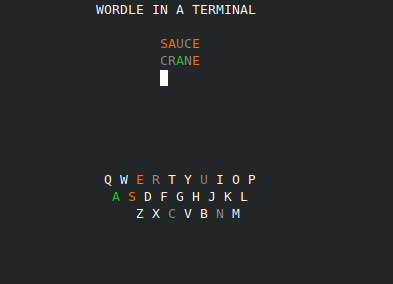

# Wordle in a terminal
Play Wordle in your terminal  



### How to run this?
You will need Python installed.  
1. First, [download the game from here](https://github.com/dalvtor/wordle-cli/archive/refs/tags/v0.7.zip) and 
uncompress it.  
2. Head to the folder where it was uncompressed, open a terminal and type the command```python3 setup.py develop```  
3. The game will be available from anywhere by typing ```wordle``` in your terminal.

### Why?
¯\\_(ツ)_/¯  
Just to play around with the Python curses module

### Disclaimer
- This has only been tested in Linux. It probably won't work in other operating systems
- The terminal has to be tall enough to show the game. If it crashes, please resize it so it's taller and relaunch the game
- If you run this in a docker container and get an error, try this: `export TERM=xterm-256color` and relaunch
- The code is awful, this was created for fun in a couple hours by someone who had no idea about curses